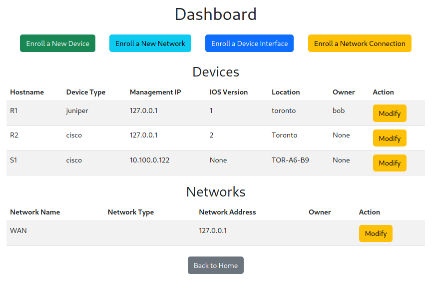

# network-automation-platform

What it can do on the back end:

- get
- delete
- update
- populate devices variables on device __init__
- establish ssh connections to cisco devices and push configuraiton changes.

What it can do on the front and:
- Endoll device, networks, device interfaces, and device_network_interfaces
- View devices & networks tables

